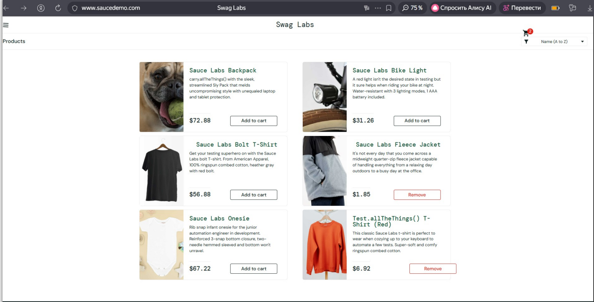
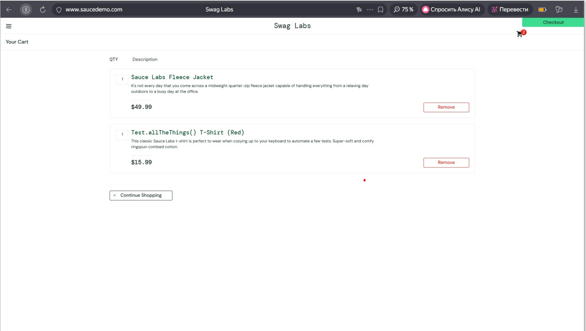

### Баг-репорт: Критические нарушения в работе корзины — неверные цены и отсутствие итоговой суммы

| Поле | Значение |
|------|----------|
| **ID** | SAUCE-CART-CRITICAL-001 |
| **Заголовок** | В корзине отображаются неверные цены товаров (отличаются от каталога) и полностью отсутствует итоговая сумма к оплате (Total) |
| **Критичность** | **Highest (Наивысшая)** |
| **Серьезность** | **Critical (Критическая)** |
| **Шаги воспроизведения** | 1. Авторизоваться как `visual_user` 2. На странице каталога запомнить цены товаров:    - "Sauce Labs Fleece Jacket": разные при апдэйте страницы    - "Test.allTheThings() T-Shirt (Red)": разные при апдэйте страницы 3. Добавить оба товара в корзину 4. Перейти в корзину 5. Наблюдать две проблемы:    а) Цены в корзине не соответствуют каталогу    б) Полностью отсутствует блок с итоговой суммой "Total" |
| **Ожидаемый результат** | 1. Цены в корзине идентичны ценам в каталоге 2. Внизу корзины отображается блок "Total" с корректно рассчитанной итоговой суммой |
| **Фактический результат** | 1. Цены в корзине отображаются некорректно (визуально другие значения) 2. Блок и поле "Total" полностью отсутствуют, пользователь не видит сумму к оплате |
| **Среда** | Yandex-браузер v. 25.12.0.2197 (64-bit) |
| **Вложения** | Скриншоты: каталога с ценами, корзины с неверными ценами и без итога |

---

## Почему это дефект, а не фича?

### Для неверных цен:
1. **Финансовый обман** — пользователь видит одну цену при выборе, другую при оформлении
2. **Нарушение законодательства** — во многих странах это прямое нарушение законов о защите прав потребителей
3. **Потеря доверия** — если цены "прыгают", сайту нельзя доверять

### Для отсутствия итога:
1. **Блокировка покупки** — пользователь физически не может завершить заказ, не зная итоговой суммы
2. **Отклонение от стандартов** — все e-commerce системы показывают итог в корзине
3. **Бизнес-потери** — 90% пользователей бросят корзину без информации о сумме

## Гипотеза о технических причинах

Гипотеза о возможных причинах возникновения дефекта
Основная гипотеза заключается в том, что система страдает от рассогласованности данных и некорректной бизнес-логики на стыке фронтенда и бэкенда. Это не одна ошибка, а системная проблема.

1. Проблема с неверными ценами в корзине

- Гипотеза A: Разные источники данных (Наиболее вероятная)
Система использует разные сервисы или таблицы БД для отображения каталога и формирования корзины, и они не синхронизированы.

Каталог (Catalog Service / таблица products): Хранит актуальные, маркетинговые цены.

Корзина/Заказ (Order Service / таблица order_items): При добавлении в корзину цена товара "замораживается" и записывается отдельно (стандартная практика), но берется она из устаревшего или некорректного источника.
- Гипотеза B: Ошибка в цепочке преобразования данных
Цена в БД хранится в центах (целое число, например 4999). При отображении в каталоге она корректно конвертируется в доллары ($49.99), а при сохранении в корзину или отображении в ней — возникает ошибка форматирования или деления.

2. Проблема с отсутствующим блоком "Total"
- Гипотеза A: Условный рендеринг с ошибкой в условии (Frontend)
Компонент Total (отвечающий за итог) рендерится только при выполнении условия, которое никогда не истинно.
- Гипотеза B: Сбой в агрегирующей функции на бэкенде
Серверный API для корзины (GET /api/cart) должен возвращать не только список товаров, но и рассчитанные поля итога (itemTotal, tax, grandTotal). Если функция расчета на сервере падает с ошибкой (например, из-за null-цены у одного из товаров), эти поля могут не добавляться в ответ. Фронтенд, не получив данные для итога, просто не показывает блок.

## Шаг 2: Конкретные исправления
- Для проблемы с ценами:

Исправить источник данных для корзины: Убедиться, что функция addToCart использует то же самое, актуальное значение price, которое отображается пользователю в каталоге.

Добавить валидацию: Ввести проверку перед сохранением в корзину: если цена товара равна 0, null или резко отличается от цены в каталога (более чем на X%), записать в лог предупреждение и использовать цену из каталога.

Исправить форматирование: Проверить цепочку конвертации цены из центов в доллары на всех этапах (бэкенд → API → фронтенд).

- Для проблемы с отсутствующим итогом:

Исправить условие рендеринга: В компоненте CartPage заменить хрупкую проверку items.length > 0 на более надежную items && items.length > 0. Рассмотреть использование стейта по умолчанию (useState([])).

Обработать ошибку сервера: Обернуть вызов calculateTotal() на сервере в try-catch. В случае ошибки логировать детали и возвращать клиенту валидный ответ с summary: null или флагом ошибки, чтобы фронтенд мог показать понятное сообщение.