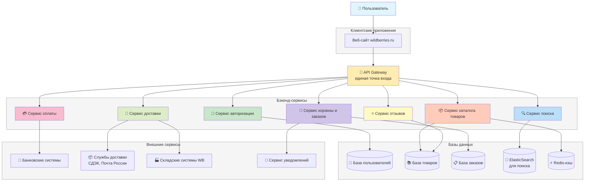

# 1. WILDBERRIES

# 1.1 Клиент-серверная архитектура

| Компонент архитектуры | 1–2 наиболее вероятных типа сбоя для этого компонента | Как этот сбой проявляется для конечного пользователя? | Тип нефункционального тестирования, наиболее подходящий для проверки устойчивости системы к данному сбою |
| :--- | :--- | :--- | :--- |
| **API Gateway** | 1. Отказ (падение) сервиса. 2. Исчерпание ресурсов (CPU, память) из-за всплеска нагрузки (DDoS-атака, флеш-распродажа). | 1. Полная невозможность пользоваться приложением. Все запросы возвращают ошибки (5xx). 2. Сильное замедление работы приложения, таймауты запросов, частичные ошибки. | Нагрузочное тестирование (Load Testing) – для определения пределов производительности и точек сбоя. Тестирование отказоустойчивости (Resilience/Failover Testing) – для проверки переключения на резервный экземпляр/кластер. |
| **База данных товаров (СУБД)** | 1. Сбой основного узла БД. 2. Высокая задержка отклика (high latency) из-за тяжелых запросов или неоптимальных индексов. | 1. Невозможность просмотреть каталог товаров, информация не загружается. 2. Медленная загрузка страниц товаров, долгое применение фильтров, "зависание" интерфейса. | Тестирование отказоустойчивости (Failover Testing) – для проверки переключения на реплику. Стресс-тестирование (Stress Testing) – для оценки деградации производительности при экстремальных нагрузках на БД. |

# 2. Сравнение "горячего" и "холодного" резерва

| Критерий | "Горячий" резерв (Hot Standby) | "Холодный" резерв (Cold Standby) |
| :--- | :--- | :--- |
| **Готовность** | Резервная система постоянно запущена и работает в режиме реального времени параллельно с основной. | Резервная система выключена или не настроена для немедленной работы. Требуется время на развертывание. |
| **Синхронизация данных** | Данные синхронизируются между основной и резервной системами непрерывно или с минимальной задержкой (репликация). | Данные синхронизируются периодически (например, раз в сутки из бэкапа) или не синхронизированы до момента активации. |
| **Время переключения (RTO)** | Секунды или минуты. Автоматическое или быстрое ручное переключение. | Часы или дни. Требуется время на установку оборудования, восстановление данных из резервной копии, настройку ПО. |
| **Стоимость** | Высокая. Требуются дополнительные ресурсы (серверы, лицензии ПО, сеть) для постоянно работающей избыточной системы. | Низкая. Ресурсы оплачиваются только в момент использования (если это облако) или простаивают. |
| **Плюсы** | Максимальная доступность, минимальное время простоя, высокая отказоустойчивость. | Низкие эксплуатационные затраты, простота управления (не нужно поддерживать синхронизацию). |
| **Минусы** | Высокие затраты на инфраструктуру и администрирование, сложность настройки синхронизации. | Длительный простой при отказе, возможна потеря данных с момента последней синхронизации (высокий RPO). |

# 2.1 Сценарий теста отказоустойчивости

Краткий сценарий теста:

Название теста: Проверка автоматического переключения на "горячий" резерв при сбое основного экземпляра микросервиса корзины.

Предыстория:

Я представляю, что в Wildberries микросервис корзины работает в кластере из двух экземпляров:

Основной экземпляр (cart-primary) — обрабатывает все запросы пользователей

"Горячий" резерв (cart-replica) — полностью запущен, синхронизирован с основным, но не получает пользовательский трафик

Балансировщик нагрузки следит за здоровьем обоих экземпляров.

Что я буду делать (шаги теста):

1. Подготовка тестового окружения:

- Убеждаюсь, что оба экземпляра (основной и резервный) работают и отображаются как "здоровые" в мониторинге

- Создаю тестового пользователя и добавляю несколько товаров в корзину

- Запускаю простой скрипт, который каждые 3 секунды проверяет содержимое корзины через API

2. Начальное состояние:

- Фиксирую, что все запросы идут через основной экземпляр (cart-primary)

- Записываю текущее содержимое корзины (какие товары и в каком количестве)

3. Имитация сбоя:

- Вручную "ломаю" основной экземпляр — например, останавливаю контейнер или процесс

- Смотрю, как система себя поведёт

4. Наблюдение за переключением:

- Слежу за скриптом: сначала он должен получить ошибку (когда основной экземпляр упал)

- Затем — через несколько секунд — запросы должны снова начать работать

- Проверяю, что теперь запросы идут через резервный экземпляр (cart-replica)

5. Проверка целостности данных:

- Убеждаюсь, что в корзине остались те же товары, что и до сбоя

- Пробую добавить новый товар в корзину — операция должна выполниться успешно

- Пробую изменить количество одного из товаров — тоже должно работать

6. Восстановление:

- Запускаю обратно основной экземпляр

- Наблюдаю, как он синхронизируется с резервным (теперь уже основным)

- Проверяю, что балансировщик снова видит его как "здоровый"

# 2.2 Метрики

| Метрика | Что это | Как буду измерять | Почему это важно |
| :--- | :--- | :--- | :--- |
| **Время простоя** | Как долго корзина была недоступна | Засеку время между последним успешным и первым успешным запросом после сбоя | Пользователь не должен долго ждать |
| **Количество потерянных запросов** | Сколько запросов не удалось выполнить | Посчитаю ошибки в логах скрипта во время переключения | Чем меньше, тем лучше |
| **Время ответа после переключения** | Как быстро отвечает резервный экземпляр | Измерю время выполнения 10 запросов сразу после переключения | Система не должна "тормозить" |
| **Целостность данных** | Не потерялись ли данные корзины | Сравню содержимое корзины до сбоя и после переключения | Товары в корзине должны сохраниться |
| **Время восстановления основного экземпляра** | Как быстро основной экземпляр вернётся в строй | Засеку время от запуска до момента, когда балансировщик снова направляет на него трафик | Показывает, как быстро система приходит в норму |