# Задание 3. Движки браузеров

Chrome, Edge - Blink

Firefox - Quantum (ранее известном как Gecko

Cайт «Школы 21»: https://21-school.ru/

| Проверяемый элемент | Конкретное отличие (Что различается и в каких браузерах) | Предполагаемая техническая причина отличия | Номер/название скриншотов |
| :--- | :--- | :--- | :--- |
| **Основной заголовок** ("Бесплатная школа цифровых технологий") | Высота текстового блока в **Mozilla Firefox** немного больше, чем в **Google Chrome** и **Microsoft Edge**. | Разное значение свойства **`line-height` (высота строки)** по умолчанию или его расчёт движком **Gecko (Firefox)** для многострочного текста по сравнению с **Blink (Chrome/Edge)**. | `a.png`, `b.png` |
| **Весь верхний баннер** (синяя область с заголовком и кнопкой) | Общая высота всего баннера в **Mozilla Firefox** больше, чем в **Google Chrome** и **Microsoft Edge**. | Совокупность различий: разные **высоты строки (`line-height`)** у текста и **алгоритмы выравнивания (`align-items`)** для flex-контейнера между движками **Gecko** и **Blink**. | `e.png`, `d.png` |
| **Время загрузки страницы** (при равных условиях) | **Mozilla Firefox — 59,8 с**, **Google Chrome — 39,7 с**, **Microsoft Edge — 39,8 с**. Firefox загружается значительно медленнее. | Различия в **производительности движка рендеринга**, кэшировании, поддержке современных веб-стандартов или **отсутствие аппаратного ускорения** по умолчанию в Firefox на конкретной системе. | `h.png`, `f.png`, `g.png` |
| **Кнопка "Поступить"** | Высота или ширина кнопки в **Mozilla Firefox** может незначительно отличаться (обычно больше) от размеров в **Google Chrome** и **Microsoft Edge**. | Разные **внутренние отступы (`padding`)** и **границы (`border`)** по умолчанию для элементов `<button>`, а также разный расчёт размеров с учётом `box-sizing` движками браузеров. | `j.png` , `i.png`|
| **Блок "Footer" (подвал сайта)** | Общая высота подвала или внутренние отступы между элементами в **Mozilla Firefox** больше, чем в **Google Chrome** и **Microsoft Edge**. | Разные значения по умолчанию для **внешних/внутренних отступов (`margin`/`padding`)** у структурных тегов (`
`, `<section>`, `<footer>`) и разный расчёт компоновки CSS Grid/Flexbox. | `l.png`, `k.png` |

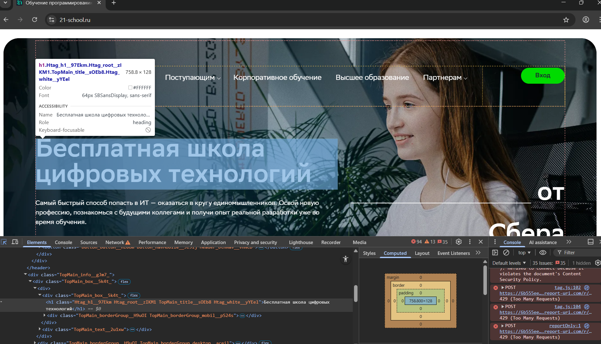
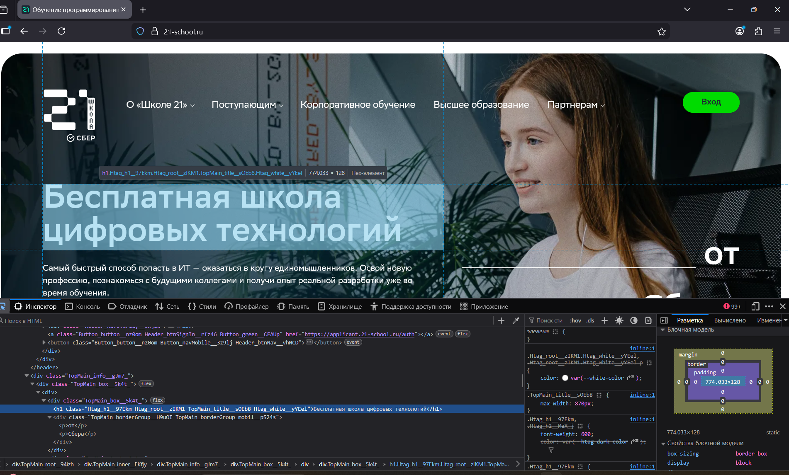
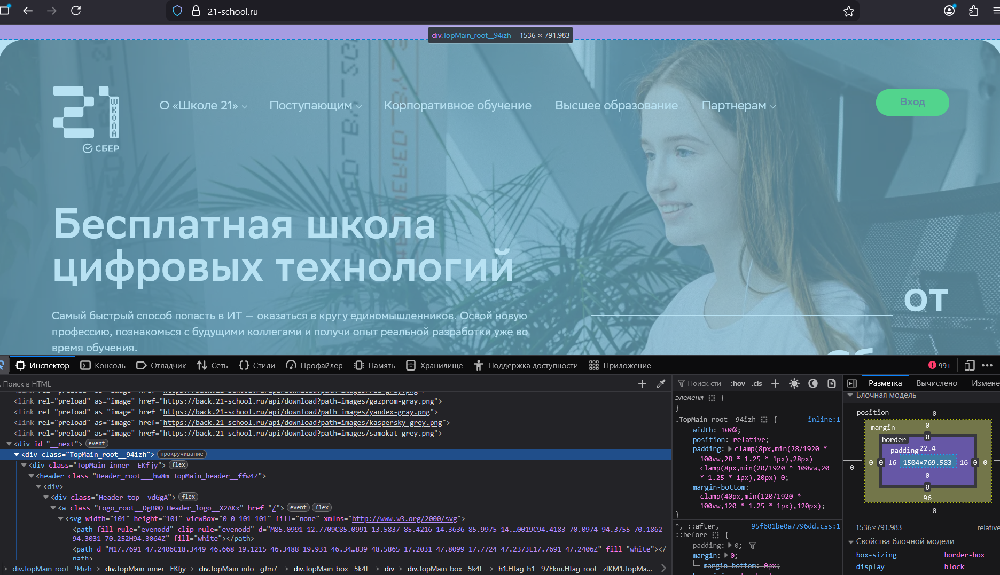
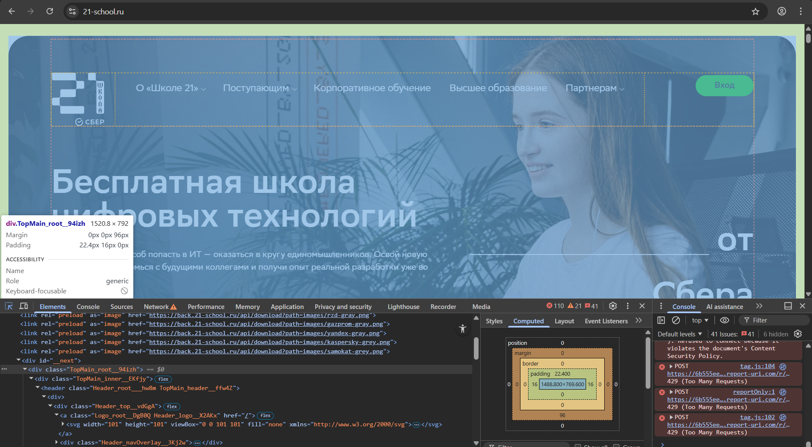
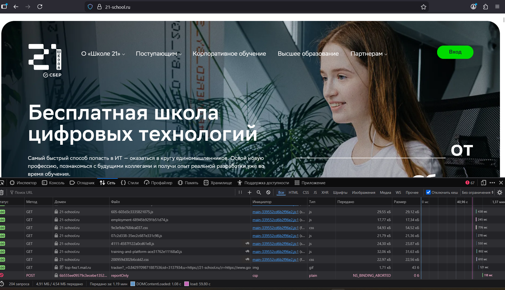
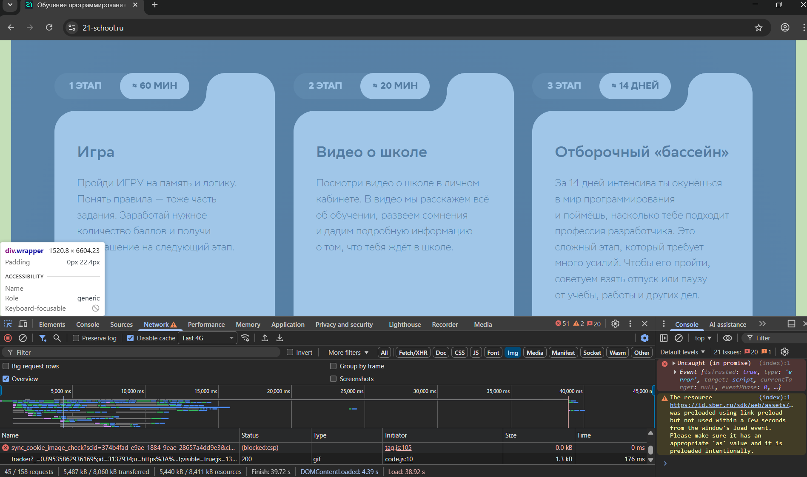
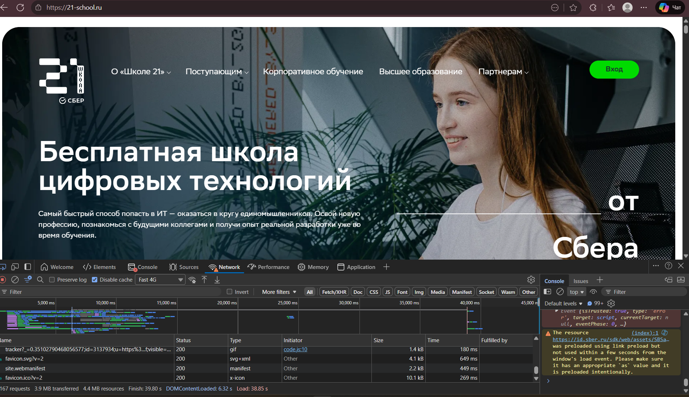
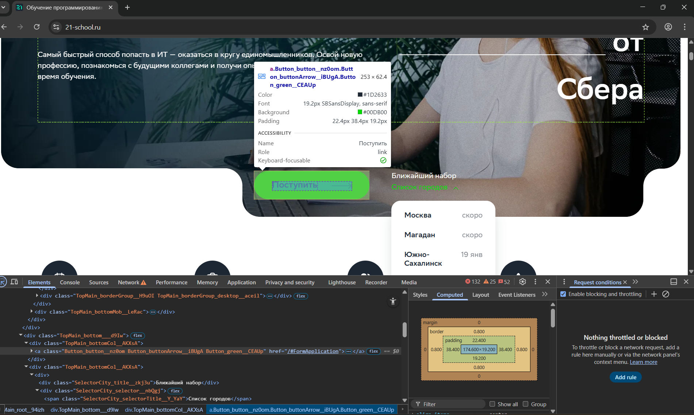
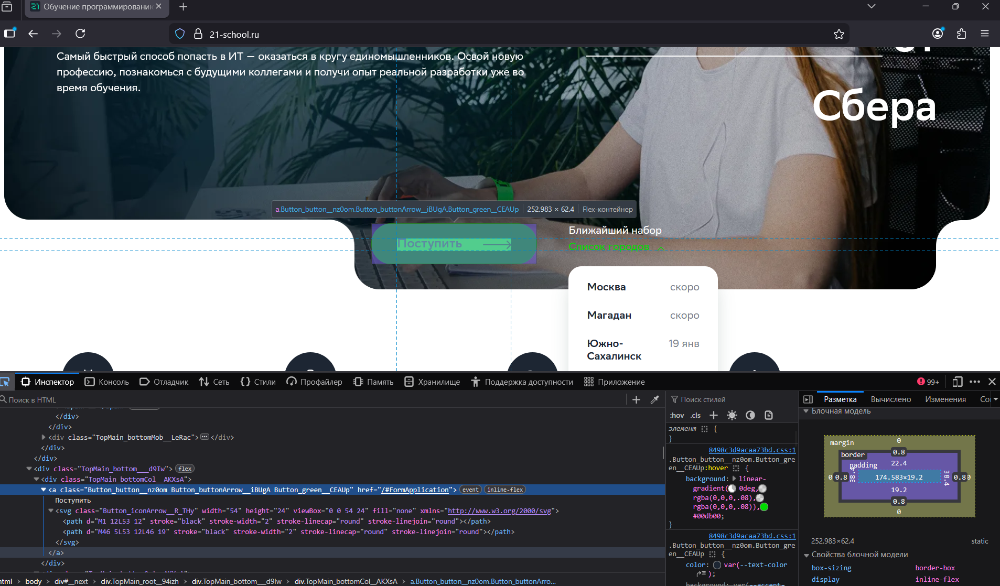
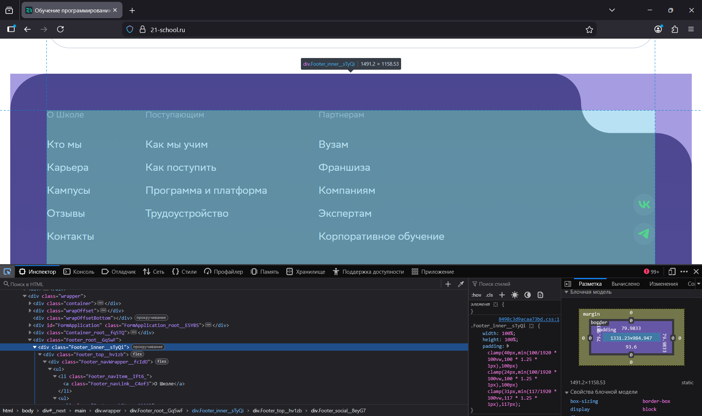
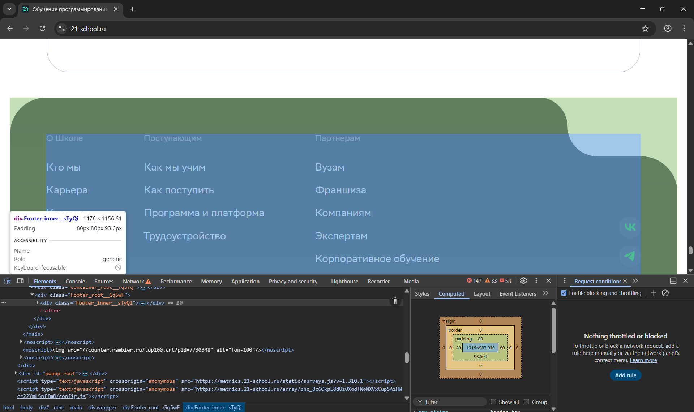

# Ключевые рекомендации разработчикам

1. Используйте CSS-сброс или нормализацию для единого базового стиля

Проблема: Различия в размерах элементов (отступы, высота строки, поля кнопок) возникают из-за разных значений по умолчанию у браузеров.

Решение: Подключить современный сброс (CSS Reset), например, modern-css-reset, или библиотеку нормализации стилей (normalize.css). 
Это создаст единую отправную точку для вёрстки во всех браузерах, минимизируя расчёты по умолчанию движками Blink, Gecko и WebKit.

2. Явно задавайте размеры и свойства для flexbox/grid-контейнеров

Проблема: Различия в высоте баннера и выравнивании кнопки — следствие разных алгоритмов расчёта flexbox/grid в движках.

Решение: Для критичных контейнеров всегда явно указывайте align-items, justify-content, min-height/height и свойство gap. 
Не полагаться на значения по умолчанию (stretch, auto), которые браузеры могут интерпретировать по-разному.

3. Тестируйте производительность и рендеринг в Firefox наравне с Chrome

Проблема: Заметная разница во времени загрузки указывает на потенциальные проблемы с производительностью или отсутствие аппаратного ускорения в Firefox.

Решение: Включите Firefox в обязательный цикл тестирования. Используйте панель Performance в DevTools Firefox для поиска «узких мест». 
Убедитесь, что для анимаций и сложной графики используются свойства, оптимизированные для рендеринга (например, transform и opacity вместо top/left).
