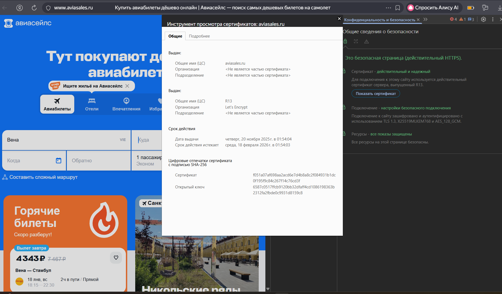
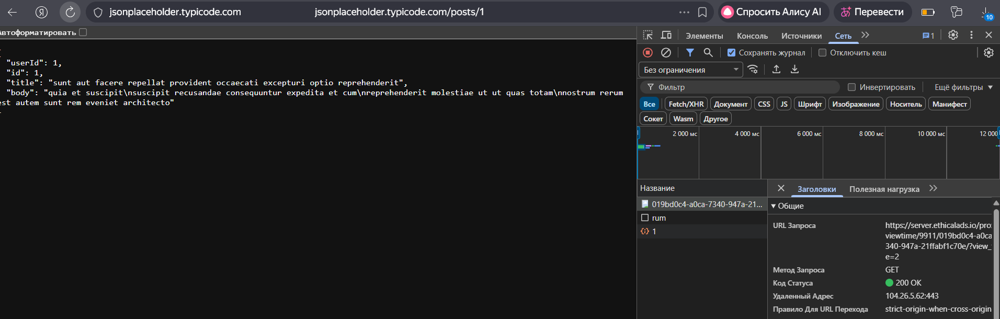
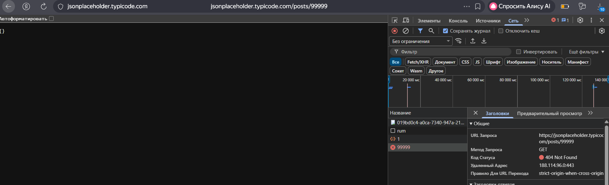
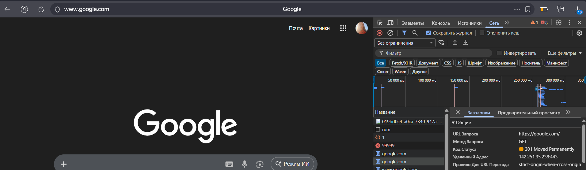

# Задание 4.

# 4.1  Установление HTTPS-соединения (Handshake)

1.Клиентское приветствие (Client Hello)

Цель: Инициировать соединение, сообщив серверу поддерживаемые клиентом версии TLS, методы шифрования (cipher suites) и сгенерированные случайные числа.

Устраняемый риск: Пассивное прослушивание (sniffing). Случайные числа гарантируют, что даже при повторном соединении сессионные ключи будут разными.

2. Серверное приветствие (Server Hello)

Цель: Подтвердить соединение и выбрать из предложенных клиентом наиболее безопасные общие параметры (версию TLS, cipher suite), а также отправить клиенту свои случайные числа.

Устраняемый риск: Атаки понижением уровня безопасности (downgrade attacks). Сервер выбирает оптимальные из поддерживаемых клиентом параметров, но не устаревшие по умолчанию.

3. Отправка сертификата сервера (Server Certificate)

Цель: Аутентифицировать сервер. Сервер отправляет клиенту свой SSL/TLS-сертификат, подписанный доверенным центром сертификации (CA).

Устраняемый риск: Атака "человек посередине" (MITM). Клиент проверяет подпись и срок действия сертификата, чтобы убедиться, что общается с настоящим aviasales.ru, а не с подставным сервером.

4. Проверка сертификата клиентом (Client Certificate Verification)

Цель: Верификация подлинности сервера. Браузер клиента проверяет цепочку доверия сертификата: срок действия, имя домена, наличие корневого сертификата издателя в своём хранилище доверенных ЦС.

Устраняемый риск: Фишинг и спуфинг. Предотвращает перехват данных злоумышленником, выдающим себя за целевой сайт с помощью поддельного сертификата.

5. Обмен сессионным ключом (Key Exchange)

Цель: Безопасно сгенерировать общий симметричный ключ для шифрования данных сессии. Часто используется алгоритм Диффи-Хеллмана, даже в его эфемерной версии (ECDHE).

Устраняемый риск: Компрометация будущих сессий. Эфемерный обмен ключами обеспечивает совершенную прямую секретность (PFS): если долговременный приватный ключ сервера будет скомпрометирован в будущем, расшифровать перехваченный трафик прошлых сессий будет невозможно.

6. Завершение рукопожатия (Handshake Finished)

Цель: Подтвердить, что рукопожатие прошло успешно и без вмешательства. Обе стороны обмениваются зашифрованными сообщениями, содержащими дайджест всех предыдущих сообщений рукопожатия.

Устраняемый риск: Подмена сообщений рукопожатия. Это финальная проверка целостности всего процесса: если хоть один бит был изменен злоумышленником, проверочные хеши не сойдутся, и соединение будет разорвано.

# 4.2 Сертификат https://www.aviasales.ru

Анализ этапов на основе данных:

Успешно пройдены (видно по использованию TLS 1.3 и валидному сертификату): Аутентификация сервера (этап 3), проверка сертификата (этап 4) и безопасный обмен ключами (этап 5, обеспечивается самой версией TLS 1.3).

Скрыты в браузере: Детали первых двух сообщений (Client/Server Hello) и процесс проверки подписи сертификата браузером скрыты от пользователя и происходят автоматически. Пользователь видит только итог — замочек в адресной строке.

# 4.3 Шпаргалка по HTTP-кодам состояния для тестирования

| Код | Что видит пользователь | Что происходит на самом деле | Как тестировать | Куда эскалировать |
| :--- | :--- | :--- | :--- | :--- |
| **100-199: Информационные** | | | | |
| **100** | Обычно ничего не видит, запрос продолжается. | Сервер получил заголовки запроса и готов к приёму тела. | Отправить большой `POST`-запрос с заголовком `Expect: 100-continue`. | Бэкенд |
| **200-299: Успех** | | | | |
| **200** | Видит запрошенную страницу или данные. | Запрос успешно обработан. | Проверить, что основные функции (загрузка страниц, отправка форм) работают и возвращают `200 OK`. | Бэкенд |
| **201** | Может увидеть сообщение "Успешно создано". | Сервер создал новый ресурс (после `POST`). | Протестировать API-эндпоинты, создающие новые объекты (например, добавление в корзину). | Бэкенд |
| **300-399: Перенаправление** | | | | |
| **301** | Автоматически попадает на новый адрес, старый больше не работает. | Запрошенный ресурс навсегда перемещён по новому URL. | Проверить старые ссылки на сайте, обновлены ли они. Использовать инструменты для проверки редиректов (cURL с ключом `-I`). | DevOps / Бэкенд |
| **400-499: Ошибки клиента** | | | | |
| **404** | Видит страницу с сообщением "Страница не найдена". | Сервер не нашёл запрошенный ресурс по указанному URL. | 1. Проверить все ссылки на сайте (битые ссылки). 2. Ввести несуществующий URL вручную. 3. Удалить (или изменить) параметры в URL существующей страницы. | Фронтенд(если текст/валидация) / Бэкенд (если ошибка в логике)
| **500-599: Ошибки сервера** | | | | |
| **500** | Видит сообщение "Внутренняя ошибка сервера". | На сервере произошла непредвиденная ошибка, нет более подходящего кода. | 1. Попробовать воспроизвести сценарий, который ранее работал. 2. Проверить логи сервера. 3. Протестировать обработку некорректных данных. | Бэкенд(приоритетно) |
| **502** | Видит сообщение "Плохой шлюз" или "Сервер временно недоступен". | Сервер, выступая в роли шлюза или прокси, получил неверный ответ от вышестоящего сервера. | Обновить страницу. Если ошибка сохраняется, проблема на стороне инфраструктуры. | DevOps/Бэкенд |

# 4.4 Запросы к API

1. Успешный запрос GET (Код 200 OK)

Сценарий: Стандартный запрос на получение существующих данных.

URL: GET https://jsonplaceholder.typicode.com/posts/1

Результат: Сервер успешно находит и возвращает запрашиваемый пост с кодом состояния 200.

2. Ошибка "Не найдено" GET (Код 404 Not Found)

Сценарий: Запрос к несуществующему ресурсу (посту с неверным ID).

URL: GET https://jsonplaceholder.typicode.com/posts/99999

Результат: Сервер понимает запрос, но не находит указанный ресурс, возвращая код 404. Тело ответа часто пустое или содержит сообщение об ошибке.

3. Код 300 "Перенаправление"

Сценарий: Запрос к старому URL.

Переход по URL, который заведомо ведёт на старый адрес http://google.com (перенаправляет на https://google.com).

Результат: В списке запросов вы увидите первый запрос со статусом 301.

