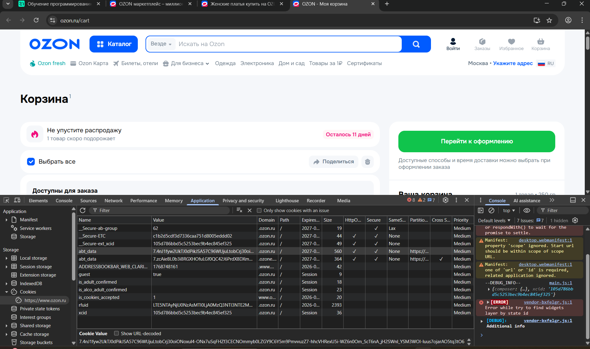

# Задание 5. Cookies

# Отчёт по исследованию cookies для сайта Ozon

**Адрес сайта:** https://www.ozon.ru

## Выбранные cookies

| Имя cookie | Тип | Предполагаемое назначение |
|------------|-----|---------------------------|
| _Secure-access-token | Персистентный | Токен доступа для авторизации пользователя, используется для аутентифицированных запросов к API |
| _Secure-refresh-token | Персистентный | Токен обновления для получения нового access token без повторного ввода логина/пароля |
| _Secure-user-id | Персистентный | Уникальный идентификатор пользователя в системе Ozon |
| _Secure-ext_xcid | Персистентный | Внешний/кросс-доменный идентификатор сессии или пользователя |
| abt_data | Персистентный | Данные A/B тестирования, хранят информацию о вариантах функционала для пользователя |

## Анализ флагов безопасности для критичных cookies

| Имя cookie | Secure | HttpOnly | SameSite | Оценка безопасности | Обоснование |
|------------|--------|----------|----------|---------------------|-------------|
| _Secure-access-token | ✅ Да | ✅ Да | Lax | ✅ Безопасно | Токен доступа защищён от передачи по HTTP (Secure), недоступен для JavaScript (HttpOnly), ограничена межсайтовая отправка (SameSite=Lax). Полная защита от MITM, XSS и CSRF атак. |
| _Secure-refresh-token | ✅ Да | ✅ Да | Lax | ✅ Безопасно | Критичный токен обновления имеет те же защиты, что и access token. Безопасная конфигурация. |
| _Secure-user-id | ✅ Да | ✅ Да | Lax | ✅ Безопасно | Идентификатор пользователя защищён должным образом. HttpOnly предотвращает кражу через XSS. |
| _Secure-ext_xcid | ✅ Да | ❌ Нет | None | ⚠️ Условно безопасно | Secure есть, но отсутствие HttpOnly создаёт риск XSS-атак. SameSite=None может быть оправдано кросс-доменным использованием, но требует осторожности. |
| _Secure-ab-group | ✅ Да | ✅ Да | Lax | ✅ Безопасно | Данные A/B тестирования защищены, хотя и менее критичны, чем токены авторизации. |

# **Флаги**

1. Secure

Что означает: Cookie будет передаваться только по HTTPS-соединению.

Как работает:

✅ С HTTPS: Cookie: sessionid=abc123

❌ Без HTTPS (HTTP): Cookie не отправляется

Зачем нужен:

- Защищает от атак "человек посередине" (MITM)

- Предотвращает перехват cookies при использовании публичных Wi-Fi

- Требуется для современных браузеров при использовании SameSite=None

2. HttpOnly

Что означает: Cookie недоступен через JavaScript.

Как работает:

✅ Сервер: Может читать/писать cookie через HTTP-заголовки

❌ JavaScript: document.cookie вернёт пустую строку для этого cookie

Зачем нужен:

- Защита от XSS-атак (Cross-Site Scripting)

3. SameSite

Что означает: Контролирует, когда cookie отправляется с кросс-сайтовыми запросами.

- Cookie отправляется (Lax):

✅ При переходе по ссылке (GET запрос)

✅ При прямой навигации

❌ При POST-запросах с других сайтов

❌ В iframe

❌ При AJAX/Fetch запросах

- None (Нет ограничений)

Cookie отправляется ВСЕГДА, даже с других сайтов

⚠️ Требует флага Secure (HTTPS)

**Почему эти флаги важны?**

- Без Secure:

Пароли и сессии могут передаваться открытым текстом

Уязвимость в публичных сетях

- Без HttpOnly:

Одна XSS-уязвимость → кража всех сессий

Злоумышленник может действовать от имени пользователя

- Неправильный SameSite:

Strict для всего: Ломает UX (ссылки из почты не работают)

None без Secure: Опасные кросс-сайтовые запросы

None для сессий: Открывает CSRF-атаки

# Корзина

### Основной кандидат:
| Параметр | Значение |
|----------|----------|
| **Имя** | xcid |
| **Значение** | 66c70404cc67686f33306983ac21ece5 |
| **Домен** | .ozon.ru |
| **Срок жизни** | Сессия (до закрытия браузера) |
| **Размер** | 36 байт |
| **Secure** | ❌ Нет (не отмечен галочкой) |
| **HttpOnly** | ❌ Нет (пустая ячейка) |
| **SameSite** | Не указан |
| **Partitioned** | Нет |

**Предполагаемое назначение:** Идентификатор сессии (cross-session ID), который, вероятно, используется для:
- Отслеживания сессии пользователя
- Связывания пользователя с его корзиной на сервере
- Аналитики поведения
- Временного хранения состояния до авторизации

### Изменения после добавления товара:

1. **Создание новой сессии:** Пользователь открыл сайт впервые, `xcid` был создан
2. **Обновление на сервере:** Данные корзины привязаны к этому ID на бэкенде
3. **Связь с другими системами:** `xcid` может связываться с `rfuid` для долгосрочного отслеживания

# Аутентификация cookie

Конкретно в случае Озон было удалено три куки, так как присутствует refresh:

| Имя cookie | Значение | Тип | Назначение |
|------------|----------|-----|------------|
| _Secure-access-token | 10.36525041.v11qmyRgAeSwRC-0Y8a.X7A... | Аутентификация | Главный токен доступа |
| _Secure-refresh-token | 10.36525041.v11qmyRgAeSwRC-0Y8a.X7A... | Аутентификация | Токен обновления сессии |
| _Secure-user-id | 36525041 | Аутентификация | ID пользователя |

После удаления и обновления пользователь разлогинен, наполнение корзины очищено.

