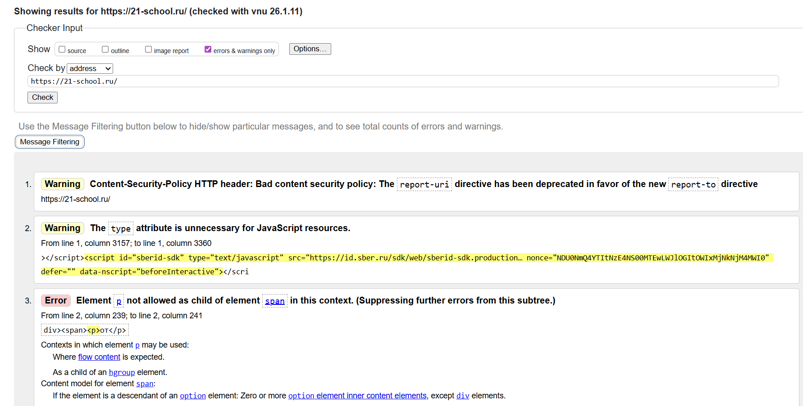

# Отчёт о валидации сайта

## Основная информация

| Параметр | Значение |
| :--- | :--- |
| **Название сайта** | 21-school.ru |
| **Адрес сайта** | https://21-school.ru/ |
| **Валидатор** | W3C Markup Validation Service |
| **Дата проверки** | 18.01.2026 |
| **Общее количество ошибок** | 14
| **Количество критичных ошибок** | 12 (влияют на отображение, функциональность и доступность) |
| **Самые частые типы ошибок** | 1. Некорректная вложенность элементов (7 случаев) 2. Нарушение иерархии заголовков (1 случай, но системная проблема) |
| **Ошибки доступности** | Присутствуют косвенные (структурные нарушения, влияющие на доступность) |
| **Качество HTML-структуры** | **Низкое** (множественные фундаментальные нарушения стандартов HTML) |

## Приоритеты исправления ошибок

### **Высокий приоритет (12 ошибок)**
Критичные ошибки, влияющие на отображение, функциональность и доступность.

| № | Описание ошибки | Влияние | Причина критичности |
| :--- | :--- | :--- | :--- |
| **3,4** | Элемент `
` внутри `` | Нарушение модели контента | Может сломать вёрстку и поведение стилей |
| **5-10** | Элемент `
` внутри `<h2>` | Семантическая ошибка | Искажает структуру документа для SEO и доступности |
| **11-13** | Элемент `<ul>` внутри `<ul>` | Нарушение структуры списка | Ломает логику вложенных списков, влияет на отображение |
| **14** | Заголовок `<h4>` следует за `<h2>` | Нарушение иерархии | Критично для доступности и SEO, дезориентирует пользователей скринридеров |

### **Средний приоритет (1 ошибка)**
Проблемы, не влияющие на отображение, но указывающие на неоптимальный код.

| № | Описание ошибки | Влияние | Рекомендация |
| :--- | :--- | :--- | :--- |
| **2** | Избыточный атрибут `type="text/javascript"` | Устаревшая практика | Удалить атрибут, так как в HTML он не требуется для скриптов JavaScript |

### **Низкий приоритет (1 ошибка)**
Предупреждения, связанные с конфигурацией сервера.

| № | Описание ошибки | Влияние | Ответственность |
| :--- | :--- | :--- | :--- |
| **1** | Устаревшая директива `report-uri` в CSP | Технический долг | DevOps/бэкенд команда, не влияет на клиентское отображение |

